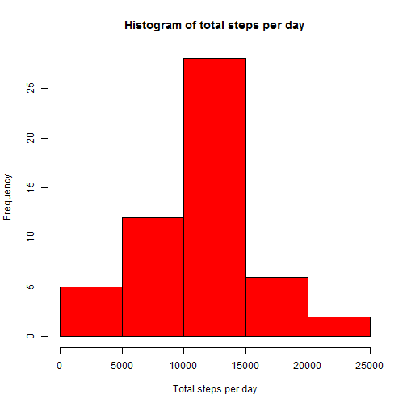
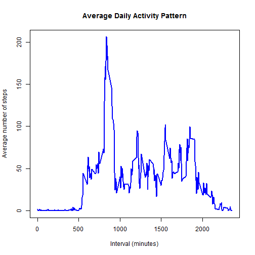
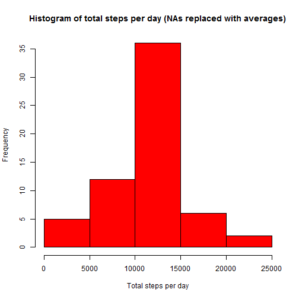
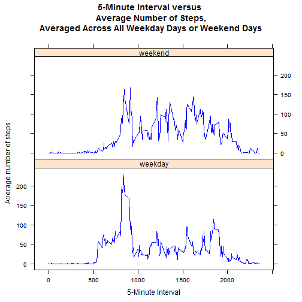

## Loading and preprocessing the data

<pre class="knitr r"># load the raw data
file&lt;- &quot;./activity.csv&quot;
data &lt;- read.csv(file,header=TRUE, colClasses = c(&quot;numeric&quot;,&quot;character&quot;,&quot;numeric&quot;))

# transform the date format
data$date &lt;- as.Date(data$date, &quot;%Y-%m-%d&quot;)
</pre>

## What is mean total number of steps taken per day?

<pre class="knitr r"># Calculate the total number of steps taken per day
aggregatedbydate &lt;- aggregate(steps ~ date, data, sum, na.rm=TRUE)

# draw histogram
library(ggplot2)
hist(aggregatedbydate$steps,main=&quot;Histogram of total steps per day&quot;,xlab=&quot;Total steps per day&quot;,col=&quot;red&quot;)
</pre>

<pre class="knitr r"># Calculate and report the mean and median of the total number of steps taken per day
mean &lt;- mean(aggregatedbydate$steps)
median &lt;- median(aggregatedbydate$steps)
print(mean)
</pre>

<pre class="knitr r">## [1] 10766.19
</pre>

<pre class="knitr r">print(median)
</pre>

<pre class="knitr r">## [1] 10765
</pre>

## What is the average daily activity pattern?

<pre class="knitr r"># Compute the means of steps accross all days for each interval
mean_data &lt;- aggregate(data$steps, by=list(data$interval), FUN=mean, na.rm=TRUE)
colnames(mean_data) &lt;- c(&quot;interval&quot;, &quot;mean_steps&quot;)

# convert interval to integers
mean_data$interval &lt;-as.integer(mean_data$interval)

# make a time-series plot
plot(mean_data$interval, mean_data$mean_steps, type=&quot;l&quot;, col=&quot;blue&quot;, lwd=2,
     xlab=&quot;Interval (minutes)&quot;,
     ylab=&quot;Average number of steps&quot;,
     main=&quot;Average Daily Activity Pattern&quot;)
</pre>

<pre class="knitr r"># find which 5-minute interval, on average across all the days in the dataset, contains the maximum number of steps
max_interval &lt;- mean_data[which.max(mean_data$mean_steps),]
print(max_interval)
</pre>

<pre class="knitr r">##     interval mean_steps
## 104      835   206.1698
</pre>

835th interval has the maximum average steps which is 206 steps.

## Imputing missing values

<pre class="knitr r"># Calculate and report the total number of missing values in the dataset
total_na &lt;- sum(is.na(data$steps))
print(total_na)
</pre>

<pre class="knitr r">## [1] 2304
</pre>

The total number of missing values is 2304.

<pre class="knitr r"># merge original data with mean_data.
newdata &lt;- merge(data, mean_data, by = 'interval', all.y = F)

# fill NA values with averages rounding up for integers
newdata$steps[is.na(newdata$steps)] &lt;- as.integer(
        round(newdata$mean_steps[is.na(newdata$steps)]))

# drop and reorder columns to match original data
header &lt;- names(data)
newdata &lt;- newdata[header]

# Calculate the total number of steps taken per day in the new dataset
new_aggregatedbydate &lt;- aggregate(steps ~ date, newdata, sum, na.rm=TRUE)

# draw histogram for the new dataset
hist(new_aggregatedbydate$steps,main=&quot;Histogram of total steps per day (NAs replaced with averages)&quot;,xlab=&quot;Total steps per day&quot;,col=&quot;red&quot;)
</pre>

<pre class="knitr r"># Calculate and report the mean and median of the total number of steps taken per day in the new dataset
new_mean &lt;- mean(new_aggregatedbydate$steps)
new_median &lt;- median(new_aggregatedbydate$steps)
print(new_mean)
</pre>

<pre class="knitr r">## [1] 10765.64
</pre>

<pre class="knitr r">print(new_median)
</pre>

<pre class="knitr r">## [1] 10762
</pre>

#### Do these values differ from the estimates from the first part of the assignment?
They do differ slightly.
Original mean was 10766.19, new mean is 10765.64.
Original median was 10765, new median is 10762.

#### What is the impact of imputing missing data on the estimates of the total daily number of steps?
It depends on the strategy that NAs are replaced. In this case, since I replaced them with average steps in the interval, it made a minor impact.

## Are there differences in activity patterns between weekdays and weekends?

<pre class="knitr r"># Create a new factor variable in the dataset with two levels - &quot;weekday&quot; and &quot;weekend&quot; indicating whether a given date is a weekday or weekend day.

weekend &lt;- weekdays(as.Date(newdata$date)) %in% c(&quot;Saturday&quot;, &quot;Sunday&quot;)
newdata$daytype &lt;- &quot;weekday&quot;
newdata$daytype[weekend == TRUE] &lt;- &quot;weekend&quot;

# convert new character column to factor
newdata$daytype &lt;- as.factor(newdata$daytype)

# Compute the average number of steps by interval accross all weekday days or weekend days
mean_newdata &lt;- aggregate(newdata$steps, by=list(newdata$interval,newdata$daytype),
FUN=mean)
colnames(mean_newdata) &lt;- c(&quot;interval&quot;, &quot;daytype&quot;,&quot;mean_steps&quot;)

# Make a panel plot containing a time series plot (i.e. type = &quot;l&quot;) of the 5-minute interval (x-axis) and the average number of steps taken, averaged across all weekday days or weekend days (y-axis)
library(lattice)
xyplot(mean_steps ~ interval|daytype, mean_newdata, type=&quot;l&quot;, col=&quot;blue&quot;,
     layout=c(1,2),
     xlab=&quot;5-Minute Interval&quot;,
     ylab=&quot;Average number of steps&quot;,
     main=&quot;5-Minute Interval versus \nAverage Number of Steps,\nAveraged Across All Weekday Days or Weekend Days&quot;)
</pre>

